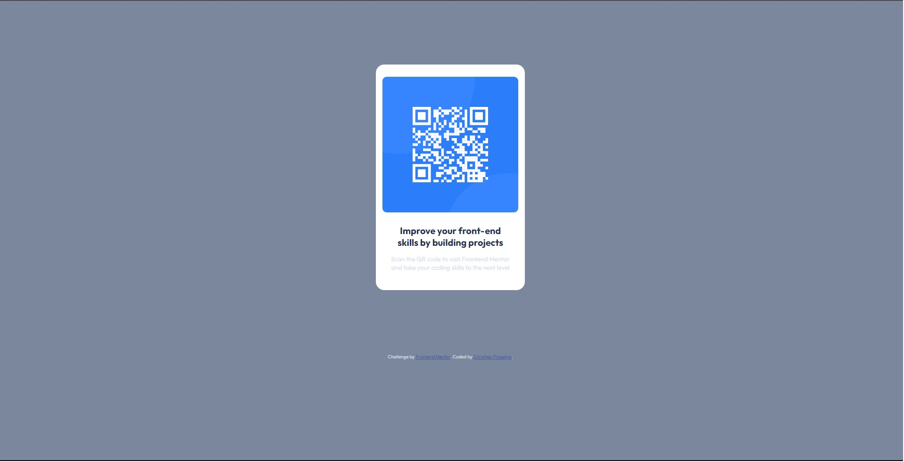
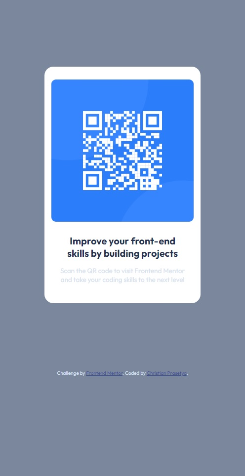

# Frontend Mentor - QR code component solution

This is a solution to the [QR code component challenge on Frontend Mentor](https://www.frontendmentor.io/challenges/qr-code-component-iux_sIO_H). Frontend Mentor challenges help you improve your coding skills by building realistic projects.

## Table of contents

- [Overview](#overview)
  - [Screenshot](#screenshot)
  - [Links](#links)
- [My process](#my-process)
  - [Built with](#built-with)
  - [What I learned](#what-i-learned)

### Screenshot

### Links

- Solution URL: [Add solution URL here](https://github.com/christian-prasetya/qr-code-component)
- Live Site URL: [Add live site URL here](https://christian-prasetya.github.io/qr-code-component/)

## My process

### Built with

- Semantic HTML5 markup
- CSS custom properties
- Flexbox
- Mobile-first workflow

### What I learned

Creating a simple but not that simple site / web component like this is teaching me a lot, especially about planning and patience developing. Working with HTML and CSS only is quite challenging, and don't just use your hunch or blindly measuring the padding, the margin, or even just the font-size or font-weight. It's all about what's in the detail to make the component or sites look neat and clean.

Second, think first before write the code, because it will make your life easier, and your code will look clean and simple.

That's the lesson I've learned, and will continue to expand my skill as front-end web developer.

## Author

- Instagram - [Christian Prasetya](https://instagram.com/cprasetya28)
- Frontend Mentor - [@christian-prasetya](https://www.frontendmentor.io/profile/christian-prasetya)
- GitHub - [@christian.prasetya](https://github.com/christian-prasetya)
